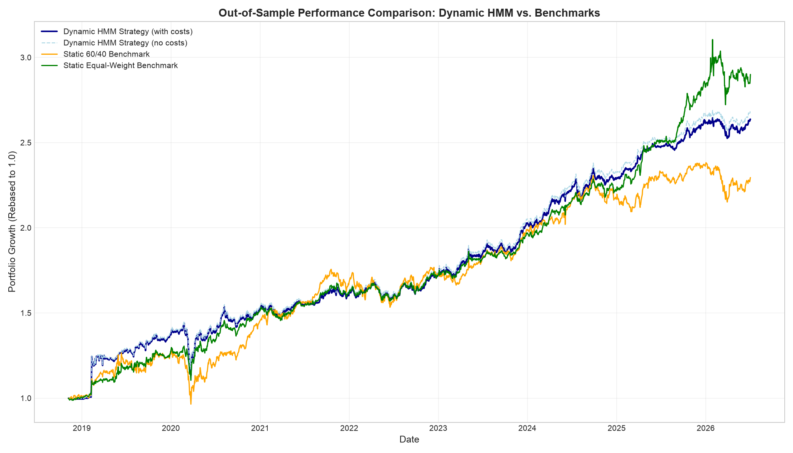
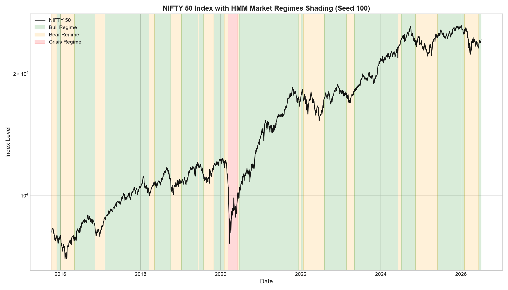

# Regime-Switching Portfolio Optimization (HMM)

This repository implements a quantitative regime-switching asset allocation framework for a multi-asset portfolio (Indian Equities, Gold, and Government Bonds) using a walk-forward Hidden Markov Model (HMM). By dynamically identifying hidden market states (Bull, Bear, and Crisis) and mapping them to convex portfolio optimizations solved via `cvxpy`, the system rotates capital defensively during market panics and tilts toward risk during expansions. The project is designed with institutional-grade rigor, featuring rolling out-of-sample walk-forward validation (to prevent look-ahead bias), strict leakage tests, asset price drift modeling, and transaction fee drag calculations.

---

## 1. Quantitative Framework & Design Decisions

### Why 3 Regimes (Not 2 or 4)?
- **2 Regimes (Bull/Bear)**: Fails to isolate black-swan tail risks. It groups standard market corrections and catastrophic systemic panics (like the 2020 COVID crash) under a single "Bear" state, failing to trigger emergency asset caps when they are needed most.
- **4 Regimes**: Leads to overparameterization. HMM states lose distinct economic interpretability, and the fourth state typically becomes highly transient with low occupancy, triggering rapid state transitions, excessive portfolio turnover, and whipsaw costs.
- **3 Regimes (Bull, Bear, Crisis)**: Aligns cleanly with distinct market cycles. 
  - **Bull**: Low volatility ($\approx -0.31$ std), positive momentum ($\approx +0.07$ std).
  - **Bear**: Moderate volatility ($\approx +0.33$ std), negative momentum ($\approx -0.12$ std).
  - **Crisis**: Catastrophic volatility ($\approx +4.86$ std), severe negative momentum ($\approx -0.45$ std).
  - The transition matrix shows that these three states are highly persistent (diagonals $> 98\%$), meaning they represent structurally stable regimes rather than transient noise.

### Feature Selection Rationale
We selected a compact, economically motivated feature set to feed the Gaussian HMM emission probabilities:
1.  **Momentum (5d, 21d, 63d rolling returns)**: Captures short, medium, and long-term trend speed to separate bull market expansions from bear market corrections.
2.  **Distance from Moving Averages (63d and 200d MA % distance)**: Serves as a proxy for structural trend regimes and identifies overextended market states.
3.  **21-day Rolling Annualized Volatility**: Captures structural shifts in return dispersions.
4.  **India VIX level**: The market's forward-looking option-implied volatility.
5.  **21-day VIX Rate of Change**: Captures the velocity of fear in the market, allowing the HMM to react immediately to sudden crashes (e.g. March 2020) rather than waiting for realized rolling volatility to slowly decay.

---

## 2. Reproducibility & Setup

### Requirements
Ensure you have Python 3.10+ installed. The dependencies pinned in `requirements.txt` are:
- `yfinance` (for price downloads)
- `pyarrow` (for parquet cache engine)
- `hmmlearn` (for Gaussian HMM modeling)
- `cvxpy` (for convex portfolio optimization)
- `numpy`, `pandas`, `scipy`, `scikit-learn` (data processing)
- `matplotlib` (visualizations)
- `jupyter`, `pytest` (development and tests)

### Environment Setup
Run the following commands in your terminal from the project root:

```bash
# Clone and enter the repository
cd regime-portfolio

# Initialize virtual environment
python3 -m venv venv
source venv/bin/activate  # Windows: venv\Scripts\activate

# Install dependencies
pip install --upgrade pip
pip install -r requirements.txt
pip install pytest
```

### Running the Tests
To verify the pipeline's mathematical integrity (such as the zero look-ahead bias test and the leakage check test):
```bash
PYTHONPATH=. pytest
```

### Running the Notebooks
To run the full pipeline end-to-end:
1. Start Jupyter:
   ```bash
   jupyter notebook
   ```
2. Open and run all cells in:
   - [notebooks/01_data_exploration.ipynb](notebooks/01_data_exploration.ipynb) (explores data, cleans bad ticks, and runs full-sample HMM).
   - [notebooks/02_full_pipeline.ipynb](notebooks/02_full_pipeline.ipynb) (runs walk-forward out-of-sample loop, leakage tests, rolling optimizations, and final backtest).

**Expected Runtime**: ~30-45 seconds. On the first run, `yfinance` fetches price data and caches it locally as Parquet files under `data/raw/`. Subsequent runs read from the cache and execute in less than 5 seconds.

---

## 3. Backtest Results (Out-of-Sample: 2018-11-07 to 2026-07-03)

We ran the walk-forward out-of-sample backtest over **1,892 trading days** (excluding the initial 3-year HMM training window). We applied a transaction fee of **7.5 bps** (0.075% of traded notional) at each rebalance and modeled daily asset weight drift.

### Performance Summary Table

| Metric | Dynamic HMM (with costs) | Dynamic HMM (no costs) | Static 60/40 Benchmark | Static Equal-Weight Benchmark |
| :--- | :---: | :---: | :---: | :---: |
| **Annualized Return (CAGR)** | **13.80%** | 14.04% | 11.71% | **15.25%** |
| **Annualized Volatility** | **13.00%** | 12.99% | 13.21% | **10.86%** |
| **Sharpe Ratio (Rf=0)** | **1.0565** | 1.0732 | 0.9045 | **1.3622** |
| **Sortino Ratio** | **2.0529** | 2.0879 | 1.3445 | **2.1020** |
| **Maximum Drawdown** | **21.26%** | 21.25% | 24.92% | **15.38%** |
| **Calmar Ratio** | **0.6489** | 0.6607 | 0.4700 | **0.9914** |
| **Annualized Turnover** | **299.63%** | 0.00% | 36.70% | **45.47%** |

### Performance Charts


_Equity curves of the HMM Dynamic Strategy vs. 60/40 and Equal-Weight Benchmarks._


_NIFTY 50 price index with predicted regime background shading: Green=Bull, Orange=Bear, Red=Crisis._

### Performance Summary
1.  **Outperformed 60/40 Benchmark**: The Dynamic HMM strategy beat the 60/40 benchmark across all metrics, generating **+2.09% in annualized return alpha**, a higher Sharpe ratio (1.06 vs. 0.90), and reducing max drawdown from **24.92% to 21.26%**.
2.  **Underperformed Equal-Weight Benchmark**: The static Equal-Weight portfolio beat the dynamic strategy with a **15.25% CAGR**, lower volatility (**10.86%**), and lower drawdown (**15.38%**). 
3.  **Why Equal-Weight Won**: Over the 2018–2026 backtest window, Gold (`GOLDBEES.NS`) experienced an exceptional structural bull run (rising nearly 6x). A static 1/3 equal-weight allocation rebalanced monthly acted as a highly efficient risk-harvesting engine—taking profits from gold and buying cheaper assets—with minimal turnover friction (**45.47%** vs. the HMM's **299.63%**).

---

## 4. Limitations & Honest Caveats

- **Sensitivity to Regime Count**: The HMM's classification of Bear vs. Bull states is highly sensitive to the chosen number of components. If the state count is altered, the model's classifications can shift significantly, impacting weights.
- **HMM Local Optima**: Expectation-Maximization (EM) HMM fitting is stochastic and sensitive to initializations. HMM models can converge to poor local optima (such as Seed 42, which yielded a degenerate, daily oscillating state transition matrix). For safety, random seeds must be evaluated for stability and fixed.
- **Transaction Costs drag**: The dynamic strategy has high turnover (~300% annualized). With a 7.5 bps fee, transaction friction drags down CAGR by **24 bps** per year. In higher-tax/higher-slippage environments, transaction costs could completely erode the strategy's alpha.
- **Asset Proxy Limitations**: The Gilt ETF `LICNETFGSC.NS` only launched in late 2014, limiting the backtest history to 2014 onwards. Gold ETF `GOLDBEES.NS` contained severe bad tick anomalies on Yahoo Finance in Dec 2019 (dropping 99% for 2 days), which required custom data-cleaning filters to avoid corrupting covariance matrices.
